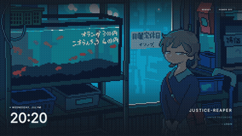

<p align="center">
  
</p>

<p align="center">
  <a href="#sddm-setup"></a>&nbsp;<a href="#quickshell-setup"></a>
</p>

<div align="center">
<pre>
<a href="#setup">ꜱᴅᴅᴍ</a>  •  <a href="#gallery">ɢᴀʟʟᴇʀʏ</a>  •  <a href="#credits">ᴄʀᴇᴅɪᴛꜱ</a>
</pre>
</div>

<br>

<p>A slimmed-down personal fork of <a href="https://github.com/Darkkal44/qylock"><b>qylock</b></a>, trimmed to a single customized theme for SDDM (login) and Quickshell (lockscreen)</p>

<br>
<p align="center">━━━━━━━ ❖ ━━━━━━━</p>

<a id="setup"></a>
<br>

<p align="center">
  
</p>
<br>

Install these dependencies with your distro's package manager (names may vary)

#### 📦 DEPENDENCIES

| | Packages |
|--:|:---|
| **Core** | `sddm` `qt6-declarative` |
| **Video** | `qt6-multimedia` `qt6-multimedia-ffmpeg` |
| **Font** | `inter-font` |

#### 🚀 INSTALLATION

```sh
git clone https://github.com/Justice-Reaper/qylock.git
cd qylock
chmod +x sddm.sh && ./sddm.sh
chmod +x quickshell.sh && ./quickshell.sh
```

<br>
<p align="center">━━━━━━━ ❖ ━━━━━━━</p>

#### ⌨️ SHORTCUT BINDING

Point your window manager keybind (Hyprland, Sway, i3, Qtile...) at:

```sh
~/.local/share/quickshell-lockscreen/lock.sh
```

<br>
<p align="center">━━━━━━━ ❖ ━━━━━━━</p>

<a id="gallery"></a>
<br>

<p align="center">
  
</p>
<br>

<div align="center">
<table style="border-collapse: collapse; border: none;">
<tr>
<td align="center" width="100%" style="padding: 15px; border: none;">
<b>Pixel · Waterfall</b><br><br>

</td>
</tr>
</table>
</div>

<br>
<p align="center">━━━━━━━ ❖ ━━━━━━━</p>

<a id="credits"></a>
<br>

<p align="center">
  
</p>

<div align="center">

Built on **[qylock](https://github.com/Darkkal44/qylock)** by **[Darkkal44](https://github.com/Darkkal44)** — all the original theme work, scripts and structure are theirs

</div>

<br>
<p align="center">━━━━━━━ ༓ ━━━━━━━</p>
